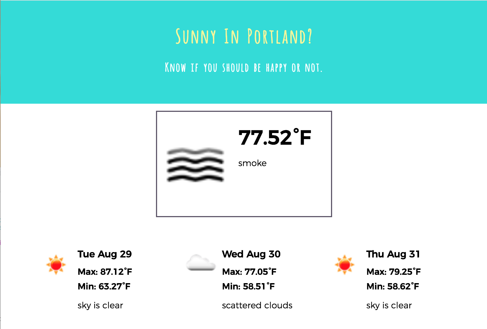

## Sunny In Portland?

Single-page web app that integrates the 5 day / 3 hour forecast API from [OpenWeatherMap](https://openweathermap.org/forecast5#format). Developed using [Create React App](https://github.com/facebookincubator/create-react-app).

Published using [Surge](http://surge.sh/); live at [hard-to-find-whip.surge.sh](http://hard-to-find-whip.surge.sh/)

### Attributions
* [React.js](https://facebook.github.io/react/)
* [react-toggle-display](https://www.npmjs.com/package/react-toggle-display)

### Author
Kezia Wineberg

### Contact
ksan8@protonmail.com